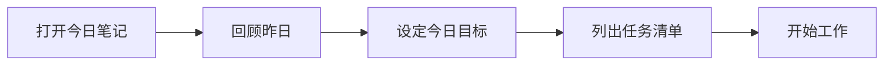

# Daily Notes 工作流

## 目录
- [什么是 Daily Notes](#什么是-daily-notes)
- [核心设置](#核心设置)
- [模板设计](#模板设计)
- [工作流程](#工作流程)
- [扩展系统](#扩展系统)
- [与其他插件集成](#与其他插件集成)
- [最佳实践](#最佳实践)
- [常见问题](#常见问题)

---

## 什么是 Daily Notes

Daily Notes（每日笔记）是一种以**日期为单位**组织笔记的系统，每天创建一个专属的笔记来记录当日的想法、任务和事件。

### 核心价值

| 价值 | 描述 |
|------|------|
| 📝 **低摩擦记录** | 有地方可以立即记录任何想法 |
| 📅 **时间线索引** | 以日期为线索回顾过去 |
| 🔗 **知识入口** | 作为创建其他笔记的起点 |
| 📊 **习惯追踪** | 记录每日习惯和反思 |
| 🧠 **思维日志** | 保存思考过程 |

### Daily Notes 系统组成

```
📅 每日笔记系统
├── 📝 Daily Notes（每日）
├── 📊 Weekly Notes（每周）
├── 📈 Monthly Notes（每月）
└── 🎯 Yearly Notes（每年）
```

---

## 核心设置

### 启用核心插件

1. 设置 → 核心插件
2. 启用 **日记** 插件

### 基础配置

| 设置 | 推荐值 | 说明 |
|------|--------|------|
| 日期格式 | `YYYY-MM-DD` | 便于排序和搜索 |
| 新建位置 | `日记/` | 专门的文件夹 |
| 模板位置 | `模板/日记模板.md` | 每日笔记模板 |
| 启动时打开 | 开启（可选） | 打开 Obsidian 自动显示今日笔记 |

### 文件夹结构

```
日记/
├── 2024/
│   ├── 2024-01-01.md
│   ├── 2024-01-02.md
│   └── ...
├── 2023/
│   └── ...
└── 周报/
    ├── 2024-W01.md
    └── ...
```

### 快捷键设置

| 操作 | 推荐快捷键 |
|------|-----------|
| 打开今日笔记 | `Alt + D` |
| 打开昨日笔记 | `Alt + Shift + D` |
| 切换到下一天 | `Alt + →` |
| 切换到上一天 | `Alt + ←` |

---

## 模板设计

### 基础模板

```markdown
---
date: {{date}}
day: {{date:dddd}}
week: {{date:WW}}
---

# 📅 {{date:YYYY-MM-DD}} {{date:dddd}}

## 📋 今日任务
- [ ] 

## 📝 笔记

## 🌟 今日亮点

## 📊 习惯追踪
- [ ] 🏃 运动
- [ ] 📚 阅读
- [ ] 🧘 冥想

---
← [[{{date-1d:YYYY-MM-DD}}]] | [[{{date+1d:YYYY-MM-DD}}]] →
```

### 使用 Templater 的高级模板

```markdown
---
date: <% tp.date.now("YYYY-MM-DD") %>
day: <% tp.date.now("dddd") %>
week: <% tp.date.now("WW") %>
month: <% tp.date.now("MMMM") %>
created: <% tp.date.now("YYYY-MM-DD HH:mm") %>
---

# 📅 <% tp.date.now("YYYY年MM月DD日 dddd") %>

## ☀️ 早间规划

### 🎯 今日三件事
1. 
2. 
3. 

### 📋 任务清单
- [ ] 

## 📝 日间记录

<% tp.file.cursor() %>

## 🌙 晚间回顾

### ✅ 完成了什么

### 🤔 学到了什么

### 💪 明日改进

### 🙏 今日感恩
1. 
2. 
3. 

## 📊 追踪

| 习惯 | 完成 |
|------|------|
| 运动 | ⬜ |
| 阅读 | ⬜ |
| 早起 | ⬜ |
| 冥想 | ⬜ |

---

**导航**：[[<% tp.date.now("YYYY-MM-DD", -1) %>|← 昨天]] | [[<% tp.date.now("YYYY-[W]WW") %>|📅 本周]] | [[<% tp.date.now("YYYY-MM-DD", 1) %>|明天 →]]
```

### 极简模板

```markdown
# <% tp.date.now("YYYY-MM-DD") %>

## 任务
- [ ] 

## 笔记

## 回顾

---
[[<% tp.date.now("YYYY-MM-DD", -1) %>]] ← → [[<% tp.date.now("YYYY-MM-DD", 1) %>]]
```

---

## 工作流程

### 早间流程



1. **打开今日笔记**：快捷键 `Alt + D`
2. **回顾昨日**：点击导航链接查看昨天的笔记
3. **设定目标**：填写"今日三件事"
4. **列出任务**：将脑中的待办事项写下来

### 日间流程

```markdown
## 📝 日间记录

### 10:30 会议笔记
与产品团队讨论了新功能 [[功能A需求文档]]

### 14:00 学习笔记
学习了 [[Python装饰器]]，创建了笔记

### 16:30 想法
💡 突然想到一个点子... #idea
```

**记录技巧**：
- 使用时间戳标记
- 创建链接到永久笔记
- 使用标签标记类型

### 晚间流程

1. **回顾完成情况**：勾选完成的任务
2. **总结收获**：写下今天学到的
3. **规划明天**：提前列出明日任务
4. **习惯打卡**：完成习惯追踪

---

## 扩展系统

### 周报模板（Weekly Notes）

需要安装 **Periodic Notes** 插件：

```markdown
---
week: <% tp.date.now("YYYY-[W]WW") %>
start: <% tp.date.weekday("YYYY-MM-DD", 0) %>
end: <% tp.date.weekday("YYYY-MM-DD", 6) %>
---

# 📊 <% tp.date.now("YYYY年 第WW周") %>

<% tp.date.weekday("YYYY-MM-DD", 0) %> 至 <% tp.date.weekday("YYYY-MM-DD", 6) %>

## 📋 本周目标

- [ ] 

## 📅 每日链接

```dataview
LIST
FROM "日记"
WHERE file.day >= date(<% tp.date.weekday("YYYY-MM-DD", 0) %>) 
  AND file.day <= date(<% tp.date.weekday("YYYY-MM-DD", 6) %>)
SORT file.day ASC
```

## 📊 本周回顾

### ✅ 完成事项

### 🔄 进行中

### 📈 数据统计

| 指标 | 目标 | 实际 |
|------|------|------|
| 运动次数 | 3 | |
| 阅读时间 | 5h | |
| 完成任务 | 15 | |

### 💡 本周收获

### 🎯 下周重点

---

**导航**：[[<% tp.date.now("YYYY-[W]WW", -7) %>|← 上周]] | [[<% tp.date.now("YYYY-MM") %>|📅 本月]] | [[<% tp.date.now("YYYY-[W]WW", 7) %>|下周 →]]
```

### 月报模板（Monthly Notes）

```markdown
---
month: <% tp.date.now("YYYY-MM") %>
---

# 📈 <% tp.date.now("YYYY年MM月") %>

## 🎯 本月目标

### OKR
- **O1**：
  - KR1：
  - KR2：

## 📊 月度总结

```dataview
TABLE 
  length(file.tasks.where(t => t.completed)) AS "完成任务",
  length(file.outlinks) AS "创建链接"
FROM "日记"
WHERE file.day >= date(<% tp.date.now("YYYY-MM-01") %>) 
  AND file.day <= date(<% tp.date.now("YYYY-MM-") + tp.date.now("DD", 0, tp.date.now("YYYY-MM") + "-01", "YYYY-MM-DD").split("-")[2] %>)
```

## 📝 月度反思

### 做得好的

### 需要改进的

### 下月计划

---

[[<% tp.date.now("YYYY-MM", -1, "YYYY-MM-01", "YYYY-MM-DD") %>|← 上月]] | [[<% tp.date.now("YYYY") %>|📅 年度]] | [[<% tp.date.now("YYYY-MM", 1, "YYYY-MM-01", "YYYY-MM-DD") %>|下月 →]]
```

---

## 与其他插件集成

### Calendar 插件

安装 **Calendar** 插件获得可视化日历：

- 点击日期快速跳转
- 看到哪些日期有笔记
- 创建周报入口

### Tasks 插件

在 Daily Notes 中追踪任务：

```markdown
## 📋 所有待办

```tasks
not done
path includes 日记
due before tomorrow
sort by due
```
```

### Dataview 查询

**本周创建的笔记**：

```dataview
LIST
FROM ""
WHERE file.ctime >= date(today) - dur(7 days)
SORT file.ctime DESC
```

**未完成的每日任务**：

```dataview
TASK
FROM "日记"
WHERE !completed
SORT file.day DESC
LIMIT 20
```

### Tracker 插件

追踪习惯和数据：

```tracker
searchType: tag
searchTarget: exercise
folder: 日记
startDate: 2024-01-01
endDate: 2024-12-31
datasetName: 运动
line:
    title: "本年运动追踪"
    yAxisLabel: "次数"
```

---

## 最佳实践

### 1. 保持一致性

```
每天同一时间写日记
使用相同的模板结构
固定的命名格式
```

### 2. 低摩擦原则

- 模板自动填充日期
- 快捷键一键创建
- 不要过度设计模板

### 3. 链接策略

```markdown
## 今日笔记

学习了 [[Python基础]] 中的装饰器概念，
参考了 [[Python装饰器详解]]。

会议中讨论了 [[Q1目标]]，
需要更新 [[项目A计划]]。
```

### 4. 定期回顾

| 频率 | 回顾内容 |
|------|----------|
| 每日 | 昨天的任务和笔记 |
| 每周 | 本周的完成情况 |
| 每月 | 月度目标进展 |
| 每季 | 季度复盘 |

### 5. 不要追求完美

```markdown
✅ 好：每天写几句话
❌ 不好：觉得要写很多才开始

✅ 好：错过一天继续
❌ 不好：中断后放弃
```

---

## 常见问题

### Q1: 每天写什么？

从这些开始：
- 今天做了什么
- 学到了什么
- 感受如何
- 明天想做什么

### Q2: 花多少时间？

建议：
- 早间：5-10 分钟
- 日间：随时记录
- 晚间：5-10 分钟

### Q3: 如何处理大量日记？

1. 使用搜索而非浏览
2. 通过链接找到相关内容
3. 定期归档旧日记
4. 使用 Dataview 查询

### Q4: 如何与其他笔记关联？

```markdown
## 今日学习
创建了新笔记 [[概念A]]，这与之前的 [[概念B]] 有关联。
```

每日笔记是**入口**，永久笔记是**目的地**。

### Q5: 移动端如何使用？

1. 确保同步设置正确
2. 使用快捷方式（Widget）快速创建
3. 简化模板减少输入

---

## 下一步

现在你已经建立了每日笔记系统！接下来学习 [Zettelkasten 方法](../workflows/01-zettelkasten.md)，了解如何将每日收集的想法转化为永久知识。

---

## 相关资源

- [Periodic Notes 插件](https://github.com/liamcain/obsidian-periodic-notes)
- [Calendar 插件](https://github.com/liamcain/obsidian-calendar-plugin)
- [Templater 插件](02-templater.md)
- [每日笔记最佳实践](https://forum.obsidian.md/t/daily-notes-workflow-examples/)
