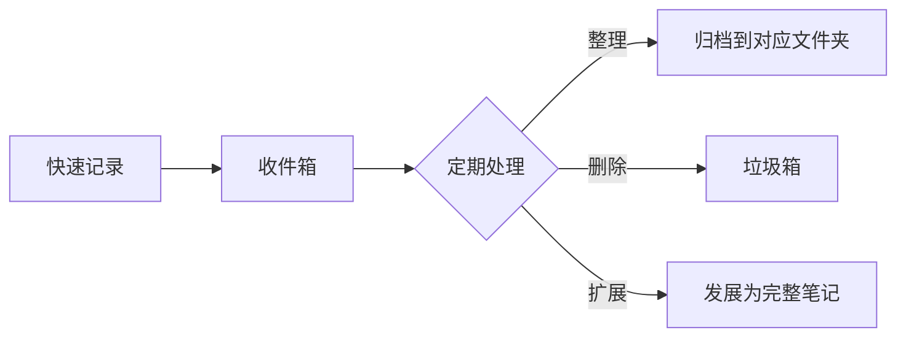

# 笔记管理

## 目录
- [文件夹组织](#文件夹组织)
- [标签系统](#标签系统)
- [搜索技巧](#搜索技巧)
- [书签与收藏](#书签与收藏)
- [笔记命名规范](#笔记命名规范)
- [最佳实践](#最佳实践)
- [常见问题](#常见问题)

---

## 文件夹组织

### 组织策略

Obsidian 对文件夹结构没有强制要求，你可以选择适合自己的方式：

| 策略 | 描述 | 适用场景 |
|------|------|----------|
| **按主题** | 根据知识领域分类 | 学术研究、技术学习 |
| **按项目** | 根据项目/任务分类 | 项目管理、工作任务 |
| **按时间** | 根据时间分类 | 日记、周报、会议记录 |
| **PARA 方法** | 项目-领域-资源-归档 | 个人知识管理 |
| **极简主义** | 少量文件夹+链接 | 卡片盒笔记法 |

### 推荐文件夹结构

```
我的笔记/
├── 00-收件箱/         # 快速捕获，稍后整理
├── 01-日记/           # 每日笔记
│   ├── 2024/
│   │   ├── 01-January/
│   │   └── 02-February/
├── 02-项目/           # 进行中的项目
│   ├── 项目A/
│   └── 项目B/
├── 03-领域/           # 持续关注的领域
│   ├── 编程/
│   ├── 健康/
│   └── 投资/
├── 04-资源/           # 参考资料
│   ├── 书籍笔记/
│   ├── 文章收藏/
│   └── 课程笔记/
├── 05-归档/           # 完成的项目
├── 模板/              # 笔记模板
└── 附件/              # 图片、文件
```

### 文件夹操作

| 操作 | 方法 |
|------|------|
| 新建文件夹 | 右键 → 新建文件夹 |
| 重命名 | 右键 → 重命名，或 F2 |
| 移动笔记 | 拖拽，或右键 → 移动 |
| 折叠全部 | 右键 → 折叠所有 |

### 使用 .obsidian 文件夹

`.obsidian` 是隐藏文件夹，存储：
- 设置配置
- 插件数据
- 主题文件
- 快捷键配置

> **注意**：不要手动修改此文件夹，除非你知道自己在做什么。

---

## 标签系统

### 标签基础

```markdown
#标签名
#嵌套/标签
#状态/进行中
#2024/Q1
```

### 标签类型

#### 1. 状态标签

```markdown
#状态/待办
#状态/进行中
#状态/已完成
#状态/搁置
```

#### 2. 类型标签

```markdown
#类型/笔记
#类型/项目
#类型/会议
#类型/想法
```

#### 3. 主题标签

```markdown
#主题/编程
#主题/设计
#主题/管理
```

#### 4. 时间标签

```markdown
#2024
#2024/Q1
#2024/01
```

### 标签 vs 文件夹

| 特性 | 标签 | 文件夹 |
|------|------|--------|
| 一对多 | ✅ 一篇笔记多个标签 | ❌ 只能在一个位置 |
| 灵活性 | ✅ 随时添加修改 | ⚠️ 移动需要时间 |
| 层级 | ✅ 嵌套标签 | ✅ 嵌套文件夹 |
| 浏览 | 通过标签面板 | 通过文件浏览器 |
| 搜索 | tag:#标签名 | path:文件夹名 |

### 标签面板

1. 启用核心插件"标签面板"
2. 在右侧边栏查看所有标签
3. 点击标签筛选相关笔记

### 标签命名规范

```markdown
# 推荐
#项目-网站重构    # 使用连字符
#book/reading     # 使用斜杠层级

# 避免
#项目 网站重构    # 空格会截断
#Project_Website  # 下划线可能有问题
```

---

## 搜索技巧

### 基础搜索

快捷键：`Ctrl/Cmd + Shift + F`

```
关键词           # 基础搜索
"完整短语"       # 精确匹配
```

### 搜索运算符

| 运算符 | 描述 | 示例 |
|--------|------|------|
| `AND` | 同时包含 | `项目 AND 计划` |
| `OR` | 包含其一 | `Python OR JavaScript` |
| `NOT` 或 `-` | 排除 | `项目 NOT 完成` 或 `项目 -完成` |
| `()` | 分组 | `(Python OR JS) AND 教程` |

### 特殊搜索

```markdown
# 按标签搜索
tag:#标签名
tag:#状态/进行中

# 按路径搜索
path:文件夹名
path:"项目/2024"

# 按文件名搜索
file:笔记名
file:会议

# 按内容搜索（默认）
content:关键词

# 按标题搜索
heading:标题内容

# 按任务搜索
task:待办内容
task-todo:未完成
task-done:已完成

# 按链接搜索
[[链接目标]]
outgoing:[[目标]]    # 链接到目标的笔记
```

### 正则表达式搜索

```markdown
# 启用正则表达式
/\d{4}-\d{2}-\d{2}/   # 匹配日期格式

# 常用正则
/TODO.*/              # 所有 TODO 行
/\[\[.*\]\]/         # 所有内部链接
/^#+ /               # 所有标题
```

### 搜索结果操作

- **复制搜索结果**：右键菜单
- **在新标签页打开**：Ctrl/Cmd + 点击
- **排序**：按相关度、修改时间、创建时间

### 保存搜索

使用书签保存常用搜索：
1. 执行搜索
2. 点击搜索栏右侧的书签图标
3. 在书签面板中随时访问

---

## 书签与收藏

### 添加书签

| 对象 | 方法 |
|------|------|
| 笔记 | 右键 → 书签此文件 |
| 搜索 | 搜索栏 → 书签图标 |
| 标题 | 右键标题 → 书签 |
| 块 | 右键段落 → 书签 |
| 图视图 | 保存当前视图 |

### 管理书签

1. 点击左侧边栏的书签图标
2. 拖拽排序
3. 创建书签分组
4. 重命名书签

### 书签分组

```
书签面板
├── 📁 工作
│   ├── 📄 项目A
│   ├── 📄 待办事项
│   └── 🔍 搜索：本周任务
├── 📁 学习
│   ├── 📄 Python教程
│   └── 📄 读书清单
└── 📄 快速笔记
```

---

## 笔记命名规范

### 命名原则

| 原则 | 描述 | 示例 |
|------|------|------|
| **唯一性** | 每篇笔记名称唯一 | 不要有多个"笔记" |
| **描述性** | 名称反映内容 | `Git-分支管理策略` |
| **简洁性** | 不要过长 | 10-50 字符 |
| **可搜索** | 包含关键词 | `Python-列表操作` |

### 命名模式

#### 1. 概念笔记

```
Git
Git-分支模型
Python-列表
React-Hooks
```

#### 2. 日期笔记

```
2024-01-15
2024-01-15-项目会议
2024-W03-周报
```

#### 3. 项目笔记

```
项目-官网重构-需求文档
项目-APP开发-技术方案
```

#### 4. Zettelkasten 风格

```
202401151423-复利效应
202401151430-时间价值
```

### 避免的命名

```markdown
# 避免
笔记1
新建笔记
未命名
Meeting Notes
test

# 推荐
Python入门-变量与类型
2024-01-15-产品需求评审
读书笔记-原子习惯
```

---

## 最佳实践

### 1. 收件箱工作流



### 2. 定期审查

| 频率 | 内容 |
|------|------|
| **每日** | 清理收件箱，处理临时笔记 |
| **每周** | 整理标签，检查孤立笔记 |
| **每月** | 归档完成项目，优化结构 |

### 3. 使用模板

为常见笔记类型创建模板：
- 会议笔记模板
- 读书笔记模板
- 项目启动模板
- 每日笔记模板

### 4. 结合链接和文件夹

```markdown
# 文件夹管理物理位置
项目/网站重构/需求文档.md

# 链接管理概念关系
这个需求涉及 [[用户认证]] 和 [[数据库设计]]
```

### 5. 渐进式组织

```
第一周：随便写，放收件箱
第一个月：开始分类，建立基础结构
三个月后：形成自己的系统
持续优化：根据使用情况调整
```

---

## 常见问题

### Q1: 文件夹还是标签？

**都用！**
- 文件夹：主要分类（项目、领域）
- 标签：次要分类（状态、类型）

### Q2: 如何处理大量笔记？

1. 使用搜索而非浏览
2. 建立 MOC（内容地图）
3. 善用链接导航
4. 定期归档旧内容

### Q3: 可以批量重命名吗？

- Obsidian 自带重命名会自动更新链接
- 批量操作可使用插件如 "File Hider" 或外部工具

### Q4: 删除的笔记去哪了？

默认移动到系统回收站或 `.trash` 文件夹。可在设置中配置。

### Q5: 如何快速找到最近的笔记？

- `Ctrl/Cmd + O` 打开快速切换
- 最近打开的笔记会在列表顶部
- 或使用"最近文件"核心插件

---

## 下一步

掌握了笔记管理后，让我们探索 [插件生态系统](02-plugin-ecosystem.md)，发现更多扩展 Obsidian 的方法！

---

## 相关资源

- [Obsidian 帮助 - 文件和文件夹](https://help.obsidian.md/Files+and+folders)
- [PARA 方法详解](../workflows/02-para-method.md)
- [Zettelkasten 方法](../workflows/01-zettelkasten.md)
