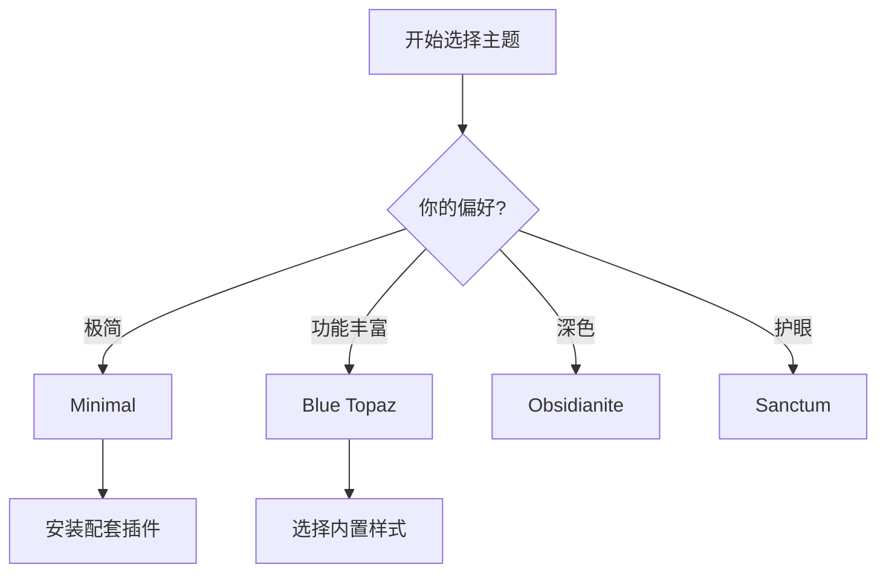

# 主题与外观

## 目录
- [主题基础](#主题基础)
- [推荐主题](#推荐主题)
- [CSS 代码片段](#css-代码片段)
- [字体设置](#字体设置)
- [界面定制](#界面定制)
- [最佳实践](#最佳实践)
- [常见问题](#常见问题)

---

## 主题基础

### 主题类型

| 类型 | 描述 |
|------|------|
| **默认主题** | Obsidian 内置主题 |
| **社区主题** | 社区开发者制作的主题 |
| **CSS 片段** | 小型样式修改 |

### 安装社区主题

1. 打开设置（`Ctrl/Cmd + ,`）
2. 进入 **外观**
3. 点击 **管理** 进入主题市场
4. 浏览并安装喜欢的主题

### 切换深色/浅色模式

- 设置 → 外观 → 基础颜色
- 或使用命令面板搜索"切换深色模式"
- 可设置跟随系统

---

## 推荐主题

### 🌟 最受欢迎主题

| 主题 | 特点 | 适合场景 |
|------|------|----------|
| **Minimal** | 极简、可定制性强 | 追求简洁的用户 |
| **Things** | 类似 Things 3 的设计 | 任务管理 |
| **Blue Topaz** | 功能丰富、中文友好 | 全能型 |
| **Prism** | 彩虹色标题 | 视觉区分 |
| **Obsidianite** | 深邃紫色调 | 深色模式爱好者 |
| **Sanctum** | 温暖舒适 | 长时间阅读 |
| **AnuPpuccin** | Catppuccin 配色 | 开发者风格 |

### 主题预览

#### Minimal 主题

```
┌─────────────────────────────────────┐
│ # 标题                              │
│ 极简设计，无多余装饰                  │
│ - 清爽的列表                         │
│ - 简洁的链接                         │
└─────────────────────────────────────┘
```

特点：
- ✅ 高度可定制
- ✅ 配套 Minimal Theme Settings 插件
- ✅ 多种颜色方案
- ✅ 性能优秀

#### Blue Topaz 主题

```
┌─────────────────────────────────────┐
│ 🎨 丰富的样式                        │
│ ├── 彩色标签                         │
│ ├── 图标文件夹                       │
│ └── 多种配色                         │
└─────────────────────────────────────┘
```

特点：
- ✅ 功能丰富
- ✅ 中文优化
- ✅ 内置多种样式
- ⚠️ 可能影响性能

---

## CSS 代码片段

CSS 代码片段允许你在不更换主题的情况下进行小型定制。

### 启用 CSS 片段

1. 设置 → 外观 → CSS 代码片段
2. 点击文件夹图标打开片段目录
3. 创建 `.css` 文件
4. 返回设置，刷新并启用

### 常用 CSS 片段

#### 1. 自定义字体

```css
/* 文件名: custom-font.css */
body {
  --font-text-theme: "霞鹜文楷", "LXGW WenKai", sans-serif;
  --font-monospace-theme: "JetBrains Mono", "Fira Code", monospace;
}
```

#### 2. 隐藏标题栏

```css
/* 文件名: hide-titlebar.css */
.titlebar {
  display: none;
}

.workspace-split.mod-root {
  padding-top: 0;
}
```

#### 3. 美化复选框

```css
/* 文件名: fancy-checkbox.css */
input[type="checkbox"]:checked {
  background-color: var(--interactive-accent);
  border-color: var(--interactive-accent);
}

.task-list-item-checkbox:checked::after {
  content: "✓";
  color: white;
}
```

#### 4. 彩虹标题

```css
/* 文件名: rainbow-headers.css */
.cm-header-1, .markdown-preview-view h1 { color: #ff6b6b; }
.cm-header-2, .markdown-preview-view h2 { color: #feca57; }
.cm-header-3, .markdown-preview-view h3 { color: #48dbfb; }
.cm-header-4, .markdown-preview-view h4 { color: #ff9ff3; }
.cm-header-5, .markdown-preview-view h5 { color: #54a0ff; }
.cm-header-6, .markdown-preview-view h6 { color: #5f27cd; }
```

#### 5. 更宽的编辑区域

```css
/* 文件名: wide-page.css */
.markdown-source-view.mod-cm6 .cm-content,
.markdown-preview-view {
  max-width: 900px;
  margin: 0 auto;
}
```

#### 6. 自定义 Callout 样式

```css
/* 文件名: custom-callout.css */
.callout[data-callout="idea"] {
  --callout-color: 255, 214, 0;
  --callout-icon: lucide-lightbulb;
}

.callout[data-callout="question"] {
  --callout-color: 0, 176, 255;
  --callout-icon: lucide-help-circle;
}
```

#### 7. 隐藏滚动条

```css
/* 文件名: hide-scrollbar.css */
::-webkit-scrollbar {
  width: 6px;
  height: 6px;
}

::-webkit-scrollbar-thumb {
  background: var(--background-modifier-border);
  border-radius: 3px;
}

::-webkit-scrollbar-thumb:hover {
  background: var(--text-muted);
}
```

---

## 字体设置

### 系统字体设置

设置 → 外观：
- **界面字体**：UI 元素使用的字体
- **正文字体**：笔记内容使用的字体
- **等宽字体**：代码块使用的字体

### 推荐字体

#### 中文字体

| 字体 | 特点 | 获取方式 |
|------|------|----------|
| **霞鹜文楷** | 开源、阅读舒适 | [GitHub](https://github.com/lxgw/LxgwWenKai) |
| **思源黑体** | Adobe + Google 开发 | [Google Fonts](https://fonts.google.com/noto/specimen/Noto+Sans+SC) |
| **思源宋体** | 适合长文阅读 | [Google Fonts](https://fonts.google.com/noto/specimen/Noto+Serif+SC) |
| **更纱黑体** | 等宽、编程友好 | [GitHub](https://github.com/be5invis/Sarasa-Gothic) |

#### 英文/代码字体

| 字体 | 特点 | 获取方式 |
|------|------|----------|
| **JetBrains Mono** | 专为编程设计 | [官网](https://www.jetbrains.com/lp/mono/) |
| **Fira Code** | 连字支持 | [GitHub](https://github.com/tonsky/FiraCode) |
| **Source Code Pro** | Adobe 开源 | [GitHub](https://github.com/adobe-fonts/source-code-pro) |
| **Inter** | 现代界面字体 | [官网](https://rsms.me/inter/) |

### 安装自定义字体

1. 下载字体文件（`.ttf` 或 `.otf`）
2. 安装到系统
3. 重启 Obsidian
4. 在设置中选择字体，或使用 CSS 片段

---

## 界面定制

### 基础界面设置

| 设置 | 位置 | 说明 |
|------|------|------|
| 强调色 | 外观 → 强调颜色 | 主题色调 |
| 字体大小 | 外观 → 字体大小 | 正文字号 |
| 缩放比例 | 外观 → 缩放 | 整体界面缩放 |
| 原生菜单 | 外观 → 使用原生菜单 | macOS 菜单栏 |

### 窗口布局

```
┌─────┬───────────────────┬─────┐
│     │                   │     │
│ 左  │    编 辑 区       │ 右  │
│ 侧  │                   │ 侧  │
│ 边  ├───────────────────┤ 边  │
│ 栏  │    第二编辑区      │ 栏  │
│     │                   │     │
└─────┴───────────────────┴─────┘
```

- **拆分窗口**：拖动标签页到边缘
- **调整宽度**：拖动分隔条
- **收起侧边栏**：点击侧边栏边缘或快捷键

### 使用工作区

保存常用布局：
1. 启用核心插件"工作区"
2. 调整好布局
3. 命令面板 → 保存当前工作区
4. 随时载入保存的工作区

### 隐藏 UI 元素

使用 Style Settings 或 Hider 插件：
- 隐藏标题栏
- 隐藏状态栏
- 隐藏滚动条
- 隐藏边栏图标

---

## 最佳实践

### 1. 主题选择建议



### 2. CSS 片段管理

```
.obsidian/snippets/
├── 00-reset.css          # 基础重置
├── 01-fonts.css          # 字体设置
├── 02-colors.css         # 颜色调整
├── 03-layout.css         # 布局修改
└── 99-experimental.css   # 实验性样式
```

### 3. 性能与美观平衡

- 不要同时启用太多 CSS 片段
- 复杂主题可能影响启动速度
- 动画效果可以关闭以提升性能

### 4. 定期更新主题

- 主题作者会修复 bug
- 新版 Obsidian 可能需要主题适配
- 检查更新：设置 → 外观 → 管理

---

## 常见问题

### Q1: 主题样式不生效？

尝试：
1. 重启 Obsidian
2. 清除缓存：设置 → 关于 → 重新载入 Obsidian
3. 检查 CSS 语法是否正确

### Q2: 更新 Obsidian 后主题失效？

等待主题作者更新，或：
1. 暂时使用默认主题
2. 查看主题 GitHub 是否有 beta 版
3. 在论坛反馈问题

### Q3: 如何备份主题设置？

备份以下文件：
- `.obsidian/themes/` - 主题文件
- `.obsidian/snippets/` - CSS 片段
- `.obsidian/appearance.json` - 外观设置

### Q4: 可以自己制作主题吗？

可以！
1. 学习 CSS 基础
2. 研究现有主题代码
3. 使用开发者工具调试
4. 参考 [主题开发文档](https://docs.obsidian.md/Themes)

### Q5: 主题和插件冲突怎么办？

1. 尝试更换主题
2. 检查插件是否有主题兼容设置
3. 使用 CSS 片段覆盖冲突样式
4. 向开发者反馈

---

## 下一步

你已经可以打造个性化的 Obsidian 了！接下来进入高级技巧部分，学习强大的 [Dataview 插件](../advanced-techniques/01-dataview.md)。

---

## 相关资源

- [Obsidian 主题市场](https://obsidian.md/themes)
- [CSS 代码片段分享](https://forum.obsidian.md/c/share-showcase/css-snippets/)
- [主题开发文档](https://docs.obsidian.md/Themes)
- [Minimal 主题文档](https://minimal.guide/)
