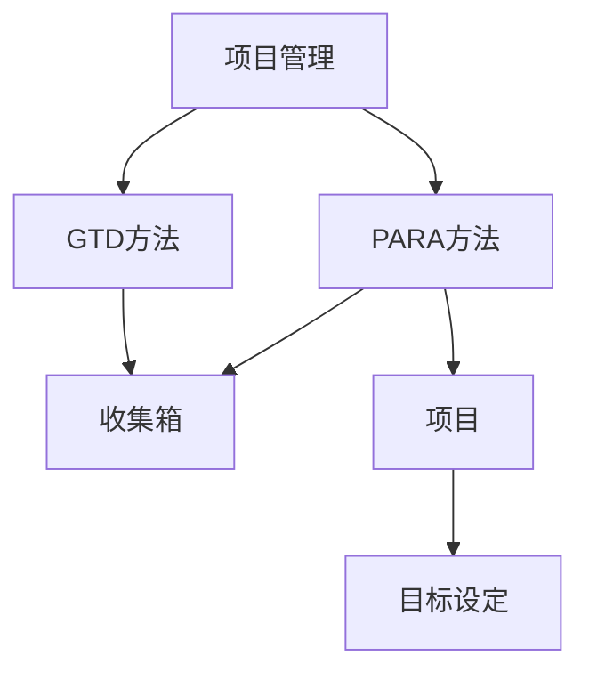

# Obsidian 简介

## 目录
- [什么是 Obsidian](#什么是-obsidian)
- [核心理念](#核心理念)
- [主要优势](#主要优势)
- [适用人群](#适用人群)
- [与其他工具对比](#与其他工具对比)
- [常见问题](#常见问题)

---

## 什么是 Obsidian

Obsidian 是一款**本地优先**的 Markdown 笔记软件，它将你的笔记作为纯文本文件存储在本地，同时提供强大的双向链接功能，帮助你构建个人知识网络。

> **Obsidian 官方口号**：A second brain, for you, forever.
> 
> 翻译：你永恒的第二大脑。

### 核心特点

| 特点 | 描述 |
|------|------|
| 📁 本地存储 | 所有笔记保存在本地文件夹，你拥有数据的完全控制权 |
| 📝 Markdown | 使用纯文本 Markdown 格式，易于迁移和长期保存 |
| 🔗 双向链接 | 笔记之间可以相互链接，形成知识网络 |
| 🔌 插件系统 | 丰富的社区插件扩展功能 |
| 🎨 高度定制 | 主题、CSS、快捷键均可自定义 |

---

## 核心理念

### 1. 本地优先 (Local-first)

Obsidian 的设计哲学是将数据存储在本地：

```
你的知识库/
├── 文件夹1/
│   ├── 笔记1.md
│   └── 笔记2.md
├── 文件夹2/
│   └── 笔记3.md
└── 附件/
    └── 图片.png
```

**优势**：
- ✅ 数据永远属于你
- ✅ 无需网络也能使用
- ✅ 可以使用任何文本编辑器打开
- ✅ 易于备份和版本控制

### 2. 链接思维 (Linked Thinking)

传统笔记是**线性**的，而 Obsidian 鼓励你建立笔记之间的**网状联系**：



### 3. 面向未来

- 使用开放格式（Markdown）
- 不依赖特定平台
- 即使 Obsidian 停止运营，你的笔记仍然可读

---

## 主要优势

### ⚡ 极致的性能
- 即使有数万笔记也能秒开
- 搜索响应迅速
- 轻量级应用，占用资源少

### 🔒 隐私与安全
- 数据存储在本地，不上传云端
- 可选的端到端加密同步（付费功能）
- 不需要登录账户也能使用

### 🎯 灵活的工作流
- 支持多种笔记方法论（Zettelkasten、PARA、GTD等）
- 不强制特定的组织方式
- 适应你的工作习惯，而非相反

### 🔌 强大的扩展性
- 1000+ 社区插件
- 100+ 精美主题
- 支持自定义 CSS

---

## 适用人群

### 最适合

| 人群 | 使用场景 |
|------|----------|
| 📚 研究人员 | 文献管理、研究笔记、论文写作 |
| 💻 程序员 | 技术文档、学习笔记、代码片段 |
| ✍️ 作家 | 素材收集、大纲创作、长文写作 |
| 🎓 学生 | 课程笔记、考试复习、知识整理 |
| 📊 知识工作者 | 会议记录、项目管理、知识沉淀 |

### 可能不适合

- 需要实时协作编辑的团队
- 只需要简单记事的用户
- 不喜欢学习新工具的人

---

## 与其他工具对比

| 特性 | Obsidian | Notion | Roam Research | Evernote |
|------|----------|--------|---------------|----------|
| 本地存储 | ✅ | ❌ | ❌ | ❌ |
| 双向链接 | ✅ | ⚠️ 基础 | ✅ | ❌ |
| 离线使用 | ✅ | ⚠️ 有限 | ⚠️ 有限 | ✅ |
| 免费使用 | ✅ | ⚠️ 有限 | ❌ | ⚠️ 有限 |
| 插件生态 | ✅ 丰富 | ⚠️ 有限 | ⚠️ 有限 | ❌ |
| 数据所有权 | ✅ 完全 | ❌ | ❌ | ❌ |

> **最佳实践**：根据你的需求选择工具。Obsidian 最适合需要长期保存、深度思考和隐私保护的用户。

---

## 常见问题

### Q1: Obsidian 免费吗？

**是的，个人使用完全免费。** 付费功能包括：
- Obsidian Sync（官方同步）
- Obsidian Publish（发布笔记为网站）
- 商业使用许可

### Q2: 如何在多设备间同步？

有几种方式：
1. **iCloud / Google Drive / OneDrive** - 将笔记库放在云盘文件夹
2. **Obsidian Sync** - 官方付费同步服务
3. **Git** - 使用版本控制同步
4. **第三方工具** - 如 Syncthing

### Q3: 可以导入其他软件的笔记吗？

可以！Obsidian 支持导入：
- Roam Research
- Notion（通过导出为 Markdown）
- Evernote（使用转换工具）
- Bear、Ulysses 等

### Q4: 学习曲线陡峭吗？

基础使用非常简单（创建笔记、链接），但要充分发挥潜力需要一定学习时间。本教程将帮助你快速上手。

---

## 下一步

准备好开始了吗？前往 [安装与设置](02-installation.md) 开始你的 Obsidian 之旅！

---

## 相关资源

- [Obsidian 官网](https://obsidian.md/)
- [Obsidian 官方论坛](https://forum.obsidian.md/)
- [Obsidian 中文社区](https://forum-zh.obsidian.md/)
- [Obsidian Hub](https://publish.obsidian.md/hub/) - 社区资源中心
