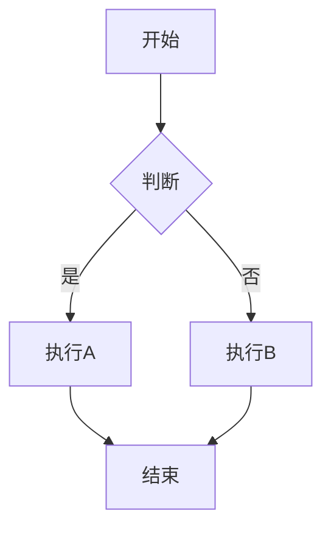
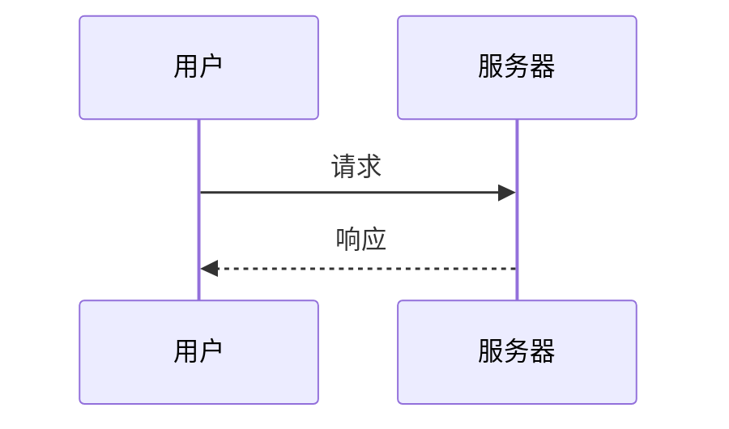

# Markdown 基础

## 目录
- [什么是 Markdown](#什么是-markdown)
- [基础语法](#基础语法)
- [扩展语法](#扩展语法)
- [Obsidian 特有语法](#obsidian-特有语法)
- [最佳实践](#最佳实践)
- [常见问题](#常见问题)

---

## 什么是 Markdown

Markdown 是一种**轻量级标记语言**，使用简单的符号来格式化文本。它的设计目标是让文档既易于编写，又易于阅读。

### 为什么使用 Markdown

| 优势 | 描述 |
|------|------|
| ✅ 简单易学 | 几分钟即可掌握基础 |
| ✅ 纯文本 | 可用任何编辑器打开 |
| ✅ 可移植 | 不依赖特定软件 |
| ✅ 面向未来 | 格式永不过时 |
| ✅ 专注内容 | 减少排版干扰 |

---

## 基础语法

### 标题

使用 `#` 符号创建标题，支持 1-6 级：

```markdown
# 一级标题
## 二级标题
### 三级标题
#### 四级标题
##### 五级标题
###### 六级标题
```

> **最佳实践**：
> - 每篇笔记只使用一个一级标题
> - 标题层级不要跳跃（如从 H2 直接到 H4）

### 段落与换行

```markdown
这是第一段。

这是第二段。（空行分隔段落）

这是一行。  
这是另一行。（行尾两个空格实现软换行）
```

### 文本格式

| 格式 | 语法 | 效果 |
|------|------|------|
| 粗体 | `**粗体**` 或 `__粗体__` | **粗体** |
| 斜体 | `*斜体*` 或 `_斜体_` | *斜体* |
| 粗斜体 | `***粗斜体***` | ***粗斜体*** |
| 删除线 | `~~删除线~~` | ~~删除线~~ |
| 高亮 | `==高亮==` | ==高亮== |

### 列表

**无序列表**：
```markdown
- 项目一
- 项目二
  - 子项目
  - 子项目
- 项目三
```

**有序列表**：
```markdown
1. 第一步
2. 第二步
3. 第三步
```

**任务列表**：
```markdown
- [x] 已完成任务
- [ ] 未完成任务
- [ ] 另一个待办
```

### 引用

```markdown
> 这是一段引用文字。
> 
> 这是引用的第二段。

> 嵌套引用
>> 二级引用
>>> 三级引用
```

### 代码

**行内代码**：
```markdown
使用 `console.log()` 打印信息。
```

**代码块**：
````markdown
```javascript
function hello() {
    console.log("Hello, World!");
}
```
````

支持的语言标识：`javascript`, `python`, `java`, `css`, `markdown`, `bash`, `json` 等。

### 链接与图片

**链接**：
```markdown
[链接文字](https://example.com)
[链接文字](https://example.com "可选标题")
```

**图片**：
```markdown


```

### 水平分割线

```markdown
---

***

___
```

---

## 扩展语法

### 表格

```markdown
| 表头1 | 表头2 | 表头3 |
|-------|:-----:|------:|
| 左对齐 | 居中 | 右对齐 |
| 内容A | 内容B | 内容C |
```

效果：

| 表头1 | 表头2 | 表头3 |
|-------|:-----:|------:|
| 左对齐 | 居中 | 右对齐 |
| 内容A | 内容B | 内容C |

### 脚注

```markdown
这是一段带有脚注的文字[^1]。

[^1]: 这是脚注的内容。
```

### 数学公式

**行内公式**：
```markdown
爱因斯坦的质能方程：$E = mc^2$
```

**块级公式**：
```markdown
$$
\sum_{i=1}^{n} x_i = x_1 + x_2 + \cdots + x_n
$$
```

### 折叠内容

```markdown
<details>
<summary>点击展开</summary>

这里是隐藏的内容。

- 项目 1
- 项目 2

</details>
```

---

## Obsidian 特有语法

### 内部链接（Wiki 链接）

```markdown
[[笔记名称]]
[[笔记名称|显示文字]]
[[笔记名称#标题]]
[[笔记名称#^块ID]]
```

**示例**：
```markdown
请参考 [[安装指南]]
详见 [[项目管理|PM 笔记]]
跳转到 [[教程#快速开始]]
```

### 嵌入内容

```markdown
![[笔记名称]]          # 嵌入整个笔记
![[笔记名称#标题]]     # 嵌入特定章节
![[图片.png]]         # 嵌入图片
![[图片.png|300]]     # 指定宽度
![[音频.mp3]]         # 嵌入音频
![[视频.mp4]]         # 嵌入视频
![[文档.pdf]]         # 嵌入 PDF
```

### 标签

```markdown
#标签名
#父标签/子标签
#2024/01/15
```

**注意**：
- 标签不能包含空格
- 使用 `/` 创建嵌套标签
- 标签区分大小写

### 块引用

给段落添加块 ID：
```markdown
这是一个重要的段落。 ^important-block
```

引用这个块：
```markdown
[[笔记名称#^important-block]]
```

### 注释

```markdown
%%这是注释，不会在预览中显示%%

%%
多行注释
可以写很多内容
%%
```

### Callouts（提示框）

```markdown
> [!note]
> 这是一个普通提示。

> [!tip]
> 这是一个小技巧。

> [!warning]
> 这是一个警告。

> [!danger]
> 这是一个危险提示。

> [!example]- 可折叠的示例
> 点击标题可以展开/折叠。
```

**支持的类型**：
`note`, `abstract`, `info`, `tip`, `success`, `question`, `warning`, `danger`, `bug`, `example`, `quote`

### Mermaid 图表

```markdown

```

```markdown

```

---

## 最佳实践

### 1. 标题规范

```markdown
# 文档标题

## 主要章节

### 子章节

正文内容...
```

### 2. 列表缩进

使用 2 或 4 个空格保持一致：

```markdown
- 项目
  - 子项目（2空格缩进）
    - 更深层级
```

### 3. 代码块标注语言

```markdown
```python
# 总是标注语言以获得语法高亮
def hello():
    print("Hello")
```
```

### 4. 链接组织

```markdown
# 在文末集中放置参考链接
详情请参考[官方文档][1]和[教程][2]。

[1]: https://example.com/docs
[2]: https://example.com/tutorial
```

### 5. 图片管理

```markdown
# 使用相对路径


# 或使用统一的附件文件夹

```

---

## 常见问题

### Q1: 如何输入特殊字符？

使用反斜杠转义：

```markdown
\*不是斜体\*
\# 不是标题
\[[不是链接\]]
```

### Q2: 表格太宽怎么办？

可以使用 HTML 或保持简洁：

```markdown
| 列1 | 列2 |
|-----|-----|
| A   | B   |
```

### Q3: 如何插入空行？

```markdown
段落一

&nbsp;

段落二（中间有空行）
```

或使用 `<br>` 标签。

### Q4: Markdown 预览和编辑不一致？

这是正常的，不同渲染器可能有细微差异。Obsidian 的实时预览模式可以最大程度减少这种差异。

---

## 下一步

掌握了 Markdown 基础后，是时候学习 Obsidian 的核心功能了。前往 [双链笔记入门](04-bidirectional-links.md) 开始探索知识连接的魔力！

---

## 相关资源

- [Markdown 官方教程](https://www.markdownguide.org/)
- [Obsidian Markdown 格式](https://help.obsidian.md/Editing+and+formatting/Basic+formatting+syntax)
- [GitHub Flavored Markdown](https://github.github.com/gfm/)
