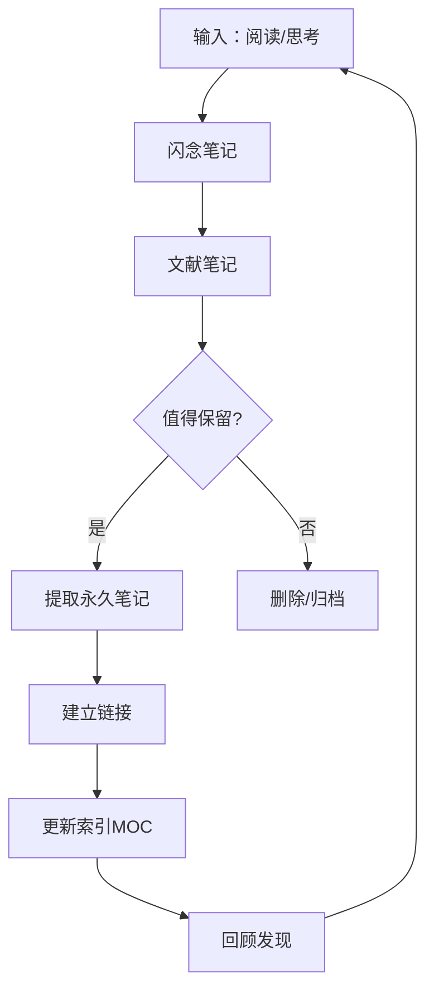

# Zettelkasten 方法

## 目录
- [什么是 Zettelkasten](#什么是-zettelkasten)
- [核心原则](#核心原则)
- [在 Obsidian 中实践](#在-obsidian-中实践)
- [笔记类型](#笔记类型)
- [工作流程](#工作流程)
- [链接策略](#链接策略)
- [最佳实践](#最佳实践)
- [常见问题](#常见问题)

---

## 什么是 Zettelkasten

Zettelkasten（德语，意为"卡片盒"）是一种**知识管理方法**，由德国社会学家尼克拉斯·卢曼（Niklas Luhmann）发明并使用。他用这个系统写出了超过 70 本书和 400 篇学术论文。

### 核心理念

```
传统笔记：📚 → 📝 → 📁 → 🔒 (遗忘)
卢曼方法：📚 → 📝 → 🔗 → 💡 → 📝 → 🔗 → 💡...
```

| 传统方法 | Zettelkasten |
|----------|--------------|
| 按主题分类 | 按链接关联 |
| 线性结构 | 网状结构 |
| 被动存储 | 主动思考 |
| 依赖记忆 | 外化思维 |
| 笔记孤立 | 笔记对话 |

### 为什么有效

1. **强制理解**：必须用自己的话重述
2. **建立联系**：每个想法都与其他想法关联
3. **渐进积累**：知识复利效应
4. **意外发现**：在链接中发现新洞见

---

## 核心原则

### 1. 原子性（Atomicity）

每张卡片只包含**一个想法**：

```markdown
❌ 错误：一篇笔记包含"投资的10个原则"
✅ 正确：10篇笔记，每篇只讲一个原则
```

**好处**：
- 易于链接
- 易于复用
- 易于理解

### 2. 自主性（Autonomy）

每张卡片应该能够**独立理解**：

```markdown
❌ 错误：
# 复利
见第3章。

✅ 正确：
# 复利
复利是指利息产生利息的过程。投资收益会在原本金和已累计
利息的基础上继续产生回报。爱因斯坦称之为"世界第八大奇迹"。

公式：A = P(1 + r/n)^(nt)

相关概念：[[单利]]、[[时间价值]]
```

### 3. 链接优先（Linking)

比分类更重要的是**建立链接**：

```markdown
# 笔记A
这个概念与 [[笔记B]] 密切相关，因为...
同时也可以应用于 [[笔记C]] 的场景。
这是对 [[笔记D]] 观点的补充。
```

### 4. 用自己的话（Own Words）

不要复制粘贴，用**自己的语言**重述：

```markdown
❌ 错误：
"复利是利息的利息"（引用）

✅ 正确：
复利是我理解为"滚雪球效应"的金融概念。当你把收益重新投入后，
新的收益会基于更大的基数计算，形成指数级增长。
```

---

## 在 Obsidian 中实践

### 文件夹结构

```
我的笔记库/
├── 0-收件箱/           # 临时笔记
├── 1-闪念笔记/         # Fleeting Notes
├── 2-文献笔记/         # Literature Notes
├── 3-永久笔记/         # Permanent Notes
│   ├── 概念/
│   ├── 观点/
│   └── 方法/
├── 4-项目笔记/         # Project Notes
├── 5-索引/             # Index/MOC
└── 模板/
```

### 命名约定

#### 1. 唯一ID（可选）

```
202401151430 复利效应
202401151445 时间价值
202401151500 72法则
```

#### 2. 描述性标题

```
复利效应
时间的复利价值
如何用72法则估算翻倍时间
```

### 必备插件

| 插件 | 用途 |
|------|------|
| Templater | 创建笔记模板 |
| Dataview | 查询和汇总笔记 |
| Graph Analysis | 分析笔记网络 |
| Smart Connections | AI辅助链接发现 |

---

## 笔记类型

### 1. 闪念笔记（Fleeting Notes）

快速捕获的临时想法：

```markdown
---
type: fleeting
created: 2024-01-15 14:30
processed: false
---

# 快速想法

刚才读到一个有趣的观点：学习的本质是建立联系，
不是记忆孤立的事实。这和神经科学的发现一致。

待办：
- [ ] 整理成永久笔记
- [ ] 链接到学习方法相关笔记
```

**特点**：
- 临时性，之后需要处理
- 不求完美，快速记录
- 24-48小时内处理

### 2. 文献笔记（Literature Notes）

阅读材料的笔记：

```markdown
---
type: literature
source: "如何阅读一本书"
author: "莫提默·艾德勒"
created: 2024-01-15
---

# 《如何阅读一本书》笔记

## 核心观点

### 阅读的四个层次
1. **基础阅读**：理解字面意思
2. **检视阅读**：快速把握结构
3. **分析阅读**：深入理解
4. **主题阅读**：跨书籍比较

## 我的思考

这与 [[费曼学习法]] 的理念相似 - 都强调主动参与。
检视阅读可以结合 [[快速阅读技巧]] 使用。

## 待处理

- [ ] 提取"分析阅读"为永久笔记
- [ ] 链接到阅读方法论 MOC
```

**特点**：
- 标注来源
- 包含自己的思考
- 标记待提取的永久笔记

### 3. 永久笔记（Permanent Notes）

你的核心知识资产：

```markdown
---
type: permanent
created: 2024-01-15
updated: 2024-01-20
related:
  - "[[学习的本质]]"
  - "[[知识管理]]"
---

# 主动阅读比被动阅读有效十倍

主动阅读意味着在阅读过程中持续与文本"对话"。这包括：
- 提出问题
- 做出预测
- 与已有知识建立联系
- 用自己的话重述

**为什么有效**：
被动阅读只激活识别记忆，而主动阅读激活回忆记忆。
根据 [[测试效应]]，回忆的努力本身就是学习。

**应用**：
可以通过 [[SQ3R阅读法]] 实践，或者使用 [[费曼学习法]] 检验理解。

**来源**：
这个观点来自 [[文献笔记/如何阅读一本书]]。

---

## 相关笔记
- [[高效学习的原理]]
- [[深度工作]]
- [[刻意练习]]
```

**特点**：
- 一个笔记一个概念
- 用自己的话表达
- 包含推理和链接
- 可独立理解

### 4. 索引笔记（MOC/Index）

组织相关笔记的地图：

```markdown
# 学习方法论 MOC

这是关于学习方法的索引笔记。

## 核心概念
- [[学习的本质]]
- [[记忆的工作原理]]
- [[遗忘曲线]]

## 学习技巧
- [[费曼学习法]]
- [[间隔重复]]
- [[主动回忆]]
- [[交错练习]]

## 阅读方法
- [[主动阅读比被动阅读有效十倍]]
- [[SQ3R阅读法]]
- [[快速阅读技巧]]

## 相关 MOC
- [[知识管理 MOC]]
- [[生产力 MOC]]
```

---

## 工作流程

### 完整流程



### 每日实践

| 时间 | 活动 |
|------|------|
| 随时 | 快速记录闪念笔记 |
| 每天 | 处理收件箱中的笔记 |
| 阅读时 | 创建文献笔记 |
| 处理时 | 提取永久笔记 |
| 每周 | 回顾和链接新笔记 |

### 处理闪念笔记

```markdown
## 处理步骤

1. 打开收件箱中的闪念笔记
2. 问自己：
   - 这个想法值得保留吗？
   - 用自己的话怎么表达？
   - 与哪些已有想法相关？
3. 创建永久笔记
4. 建立至少一个链接
5. 删除或归档原始笔记
```

---

## 链接策略

### 链接类型

#### 1. 直接链接

```markdown
[[复利]] 是投资中最重要的概念之一。
```

#### 2. 上下文链接

```markdown
这个原理可以用 [[复利]] 来类比——时间的投入也会产生复利效应。
```

#### 3. 结构链接

```markdown
## 相关概念
- 上级：[[投资基础]]
- 同级：[[单利]]、[[年化收益率]]
- 下级：[[72法则]]、[[复利计算]]
```

### 何时链接

```markdown
✅ 应该链接：
- 提到的概念有自己的笔记
- 两个想法有逻辑关系
- 想要将来找到这个联系

❌ 不需要链接：
- 只是随口提到
- 没有实质性关系
- 链接不会增加价值
```

### 链接发现

1. **写作时**：主动思考相关笔记
2. **使用搜索**：`Ctrl/Cmd + O` 查找相关笔记
3. **查看反向链接**：发现意外的联系
4. **浏览图视图**：可视化知识网络

---

## 最佳实践

### 1. 从小开始

```
第1周：每天创建1个永久笔记
第2周：每天创建2个永久笔记
第3周：每天创建3个永久笔记
...

持续比完美更重要
```

### 2. 质量优于数量

```markdown
❌ 错误：收集1000条引用但从不处理
✅ 正确：仔细处理100个想法并建立链接
```

### 3. 信任系统

```
不要担心"忘记"某个笔记。
如果它重要，会通过链接和搜索重新找到。
Zettelkasten 的价值在于连接，不在记忆。
```

### 4. 定期回顾

每周花 30 分钟：
- 处理收件箱
- 为新笔记添加链接
- 浏览图视图
- 发现新的连接

### 5. 写给未来的自己

```markdown
# 好的笔记

清楚解释了概念，包含足够上下文，
未来读到时能够理解。

# 不好的笔记

"这个很有趣"
"记住这个"
"TODO: 稍后处理"
```

---

## 常见问题

### Q1: 如何开始？

1. 从现有笔记中选择一个主题
2. 创建 3-5 个原子化笔记
3. 建立它们之间的链接
4. 逐渐扩展

### Q2: 笔记应该多长？

200-500 字是理想长度。能够完整表达一个想法，但不会太长。

### Q3: 如何决定什么值得记录？

问自己：
- 这改变了我的想法吗？
- 将来会用到吗？
- 与其他想法有什么联系？

### Q4: 会不会太多笔记找不到？

不会。这正是 Zettelkasten 的优势：
- 通过链接自然导航
- 通过搜索快速找到
- 通过 MOC 组织访问

### Q5: 需要给笔记编号吗？

可选。现代工具（如 Obsidian）通过链接代替了传统的编号系统。如果喜欢，可以使用时间戳前缀。

---

## 下一步

Zettelkasten 专注于知识的网状组织，而 [PARA 方法](02-para-method.md) 提供了另一种以行动为导向的组织方式。两种方法可以结合使用！

---

## 相关资源

- [How to Take Smart Notes](https://www.soenkeahrens.de/en/takesmartnotes) - Sönke Ahrens
- [Zettelkasten.de](https://zettelkasten.de/) - 方法详解
- [Andy Matuschak's Notes](https://notes.andymatuschak.org/) - 实践示例
- [LYT Kit](https://www.linkingyourthinking.com/) - Nick Milo 的链接思维方法
