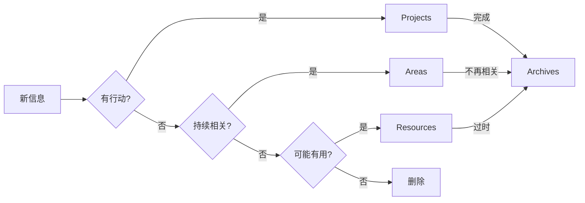
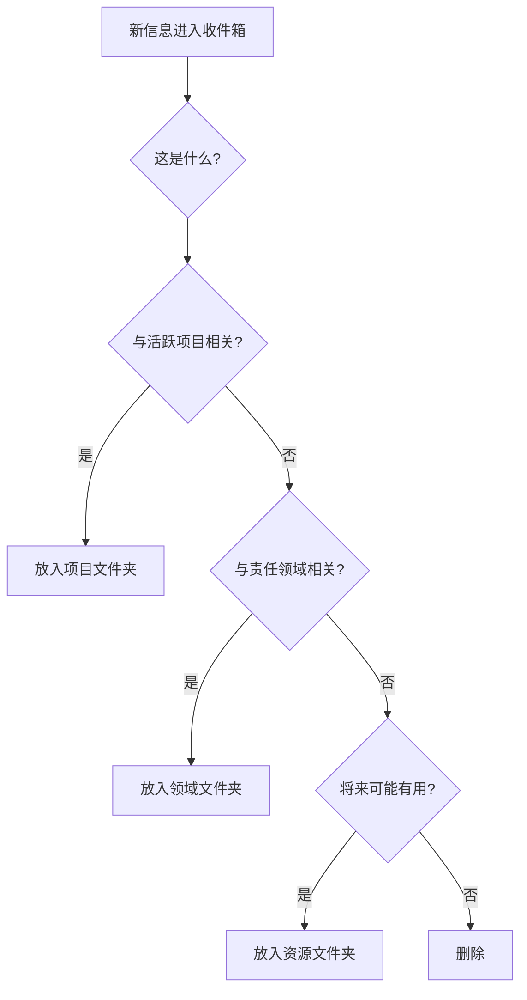

# PARA 方法

## 目录
- [什么是 PARA](#什么是-para)
- [四个分类详解](#四个分类详解)
- [在 Obsidian 中实施](#在-obsidian-中实施)
- [工作流程](#工作流程)
- [与其他方法结合](#与其他方法结合)
- [最佳实践](#最佳实践)
- [常见问题](#常见问题)

---

## 什么是 PARA

PARA 是由 Tiago Forte 提出的**数字信息组织系统**，将所有信息分为四个类别：

| 字母 | 全称 | 含义 |
|------|------|------|
| **P** | Projects | 项目 - 有明确目标和截止日期的任务集合 |
| **A** | Areas | 领域 - 需要持续维护的责任范围 |
| **R** | Resources | 资源 - 可能有用的参考资料 |
| **A** | Archives | 归档 - 不再活跃的内容 |

### 核心理念

```
信息的组织应该服务于行动，而不是知识分类。
```

### 与传统分类的区别

| 传统方法 | PARA 方法 |
|----------|-----------|
| 按主题分类 | 按行动性分类 |
| 学术分类法 | 实用导向 |
| 静态结构 | 动态流动 |
| 复杂层级 | 简单四层 |

### 信息流动



---

## 四个分类详解

### P - Projects（项目）

**定义**：有**明确目标**和**截止日期**的任务集合。

```markdown
# 项目特征
✅ 有明确的完成标准
✅ 有开始和结束日期
✅ 需要多个步骤完成
✅ 完成后可以归档

# 示例
- 🎓 完成 Python 课程（1月底前）
- 🏠 装修书房（3月前）
- 📱 上线个人网站（2月15日）
- 📚 读完《原子习惯》（2周内）
- 🎉 策划生日派对（3月10日）
```

**项目笔记结构**：

```markdown
---
type: project
status: active
created: 2024-01-15
deadline: 2024-02-15
area: "[[职业发展]]"
---

# 🎯 项目：个人网站上线

## 目标
创建并上线个人作品集网站。

## 成功标准
- [ ] 网站可以访问
- [ ] 包含至少5个作品
- [ ] 移动端适配

## 任务
- [ ] 选择技术栈
- [ ] 设计页面布局
- [ ] 开发首页
- [ ] 添加作品集页面
- [ ] 部署上线

## 资源
- [[网页设计灵感]]
- [[前端开发笔记]]

## 进度日志
### 2024-01-15
- 项目启动，确定使用 Next.js
```

### A - Areas（领域）

**定义**：需要**持续维护**的**责任范围**，没有明确的结束日期。

```markdown
# 领域特征
✅ 持续存在的责任
✅ 没有结束日期
✅ 需要维持一定标准
✅ 与你的角色相关

# 示例
- 💼 工作/职业
- 💰 财务管理
- 🏥 健康
- 👨‍👩‍👧 家庭
- 📚 学习成长
- 🏠 居住环境
- 🎮 兴趣爱好
- 👥 人际关系
```

**领域笔记结构**：

```markdown
---
type: area
---

# 💰 财务管理

## 当前状态
- 应急资金：3个月支出
- 投资组合：股债 7:3

## 持续目标
- 每月储蓄率 > 30%
- 每季度复盘投资
- 年度财务规划

## 活跃项目
```dataview
LIST
FROM "项目"
WHERE area = "[[财务管理]]" AND status = "active"
```

## 相关资源
- [[投资入门指南]]
- [[记账方法]]
- [[税务规划]]

## 定期检查清单
- [ ] 每月：检查账单
- [ ] 每季度：复盘投资
- [ ] 每年：更新保险
```

### R - Resources（资源）

**定义**：可能在将来**有用的参考资料**，与当前项目或领域无直接关联。

```markdown
# 资源特征
✅ 主题性收集
✅ 供将来参考
✅ 兴趣驱动
✅ 不需要行动

# 示例
- 📖 读书笔记
- 🎨 设计灵感
- 💻 编程技巧
- 🌍 旅行攻略
- 🍳 食谱收藏
- 📝 写作素材
- 🎵 音乐推荐
```

**资源笔记结构**：

```markdown
---
type: resource
topic: 设计
updated: 2024-01-15
---

# 🎨 网页设计灵感

## 收藏网站
- [Dribbble](https://dribbble.com)
- [Awwwards](https://awwwards.com)
- [Behance](https://behance.net)

## 颜色搭配
- [[配色方案收集]]
- [[色彩心理学]]

## 布局参考
- [[极简设计案例]]
- [[响应式设计模式]]

## 字体组合
- [[推荐字体配对]]

## 灵感图片
![[design-inspiration-1.png]]
```

### A - Archives（归档）

**定义**：不再活跃的项目、不再相关的领域、过时的资源。

```markdown
# 归档内容
- ✅ 已完成的项目
- ❌ 取消的项目
- 📴 不再维护的领域
- 🗓️ 过时的资源
- 📁 历史记录

# 归档不等于删除
归档的内容仍然可以搜索和引用，
只是不再出现在活跃视图中。
```

**归档结构**：

```
归档/
├── 项目/
│   ├── 2024/
│   │   ├── 个人网站 V1（已完成）/
│   │   └── Python课程（已完成）/
│   └── 2023/
│       └── ...
├── 领域/
│   └── 前公司相关/
└── 资源/
    └── 过时技术/
```

---

## 在 Obsidian 中实施

### 文件夹结构

```
我的笔记库/
├── 0-收件箱/           # 快速捕获
├── 1-项目/             # Projects
│   ├── 🎯 个人网站/
│   ├── 📚 读书计划/
│   └── _项目模板.md
├── 2-领域/             # Areas
│   ├── 💼 工作/
│   ├── 💰 财务/
│   ├── 🏥 健康/
│   └── 📚 学习/
├── 3-资源/             # Resources
│   ├── 📖 读书笔记/
│   ├── 💻 技术笔记/
│   └── 🎨 灵感收集/
├── 4-归档/             # Archives
│   ├── 项目归档/
│   └── 领域归档/
├── 日记/               # Daily Notes
└── 模板/
```

### 使用标签补充分类

```markdown
# 可以用标签标记状态和类型
#project/active
#project/paused
#area/work
#area/personal
#resource/reference
#resource/inspiration
```

### Dataview 仪表板

**活跃项目看板**：

````markdown
```dataview
TABLE 
  status AS "状态",
  deadline AS "截止日期",
  area AS "所属领域"
FROM "1-项目"
WHERE status = "active"
SORT deadline ASC
```
````

**领域概览**：

````markdown
```dataview
TABLE 
  length(filter(file.inlinks, (l) => contains(l.path, "项目"))) AS "相关项目"
FROM "2-领域"
SORT file.name ASC
```
````

---

## 工作流程

### 信息处理流程



### 每日工作流

| 时间 | 活动 |
|------|------|
| 早上 | 查看活跃项目列表 |
| 工作时 | 在项目文件夹中工作 |
| 遇到新信息 | 快速分类到 PARA |
| 晚上 | 清理收件箱 |

### 每周回顾

```markdown
## 每周回顾清单

### 项目检查
- [ ] 所有项目是否仍然活跃？
- [ ] 有项目可以完成归档吗？
- [ ] 需要创建新项目吗？

### 领域检查
- [ ] 各领域状态如何？
- [ ] 有需要关注的领域吗？

### 收件箱清理
- [ ] 处理所有收件箱条目
- [ ] 分类到正确位置

### 归档整理
- [ ] 移动完成的项目到归档
```

### 项目生命周期

```
1. 识别项目 → 创建项目文件夹
2. 规划 → 定义目标和任务
3. 执行 → 在项目中工作
4. 完成 → 达成目标
5. 归档 → 移动到归档
6. 反思 → 总结经验
```

---

## 与其他方法结合

### PARA + Zettelkasten

```
PARA 管理行动相关的信息
Zettelkasten 管理知识积累

结合方式：
├── 1-项目/        # PARA
├── 2-领域/        # PARA  
├── 3-资源/        # PARA（包含文献笔记）
├── 4-归档/        # PARA
└── 5-卡片盒/      # Zettelkasten 永久笔记
```

### PARA + GTD

```
GTD 收件箱 → PARA 收件箱
GTD 下一步行动 → 在项目文件夹中
GTD 等待中 → 项目中的等待任务
GTD 将来/也许 → 资源或暂停项目
GTD 参考资料 → 资源文件夹
```

### PARA + Daily Notes

```markdown
# 每日笔记模板

## 今日项目工作
- [[项目A]]：完成了任务1
- [[项目B]]：开始了任务2

## 收集的信息
- 看到一篇关于 [[设计]] 的好文章 → 移到资源

## 明日计划
- 继续 [[项目A]]
```

---

## 最佳实践

### 1. 项目清单要短

```markdown
# 理想状态
活跃项目：5-10 个

# 过多的信号
- 经常忘记某些项目
- 项目长期没有进展
- 感到压力和混乱
```

### 2. 保持层级简单

```markdown
# 好的结构
1-项目/
├── 项目A/
└── 项目B/

# 避免过深嵌套
1-项目/
├── 工作/
│   ├── 客户A/
│   │   ├── 2024/
│   │   │   └── Q1/
│   │   │       └── 项目X/  # 太深了！
```

### 3. 定期归档

```markdown
# 每周
- 完成的项目 → 归档

# 每月
- 不活跃的资源 → 归档
- 不再相关的领域 → 归档

# 归档而不是删除
将来可能需要参考
```

### 4. 从行动角度思考

```markdown
❌ "这属于什么类别？"
✅ "这与什么项目相关？"
✅ "我什么时候会用到这个？"
```

### 5. 适应你的需求

```markdown
# PARA 是框架，不是教条

可以修改：
- 使用不同的文件夹名称
- 添加额外的顶层分类
- 调整子文件夹结构
- 结合其他方法
```

---

## 常见问题

### Q1: 项目和领域有什么区别？

| 项目 | 领域 |
|------|------|
| "发布个人网站" | "职业发展" |
| "完成 Python 课程" | "编程学习" |
| "减重 5 公斤" | "健康" |
| "策划生日派对" | "家庭" |

**测试**：如果可以"完成"它，就是项目；如果需要"维持"它，就是领域。

### Q2: 一个笔记可以属于多个类别吗？

在 Obsidian 中：
- 物理位置只能有一个
- 使用链接关联到其他位置
- 使用标签标记多重属性

```markdown
# 放在项目文件夹
项目A/会议笔记.md

# 链接到领域
在 [[工作]] 领域中引用这个笔记
```

### Q3: 如何处理跨项目的资源？

放在资源文件夹，在项目中链接：

```markdown
# 在资源中
3-资源/设计规范.md

# 在项目中引用
参考 [[设计规范]] 进行设计
```

### Q4: 要给所有东西分类吗？

不需要。PARA 的目的是减少决策疲劳，不是增加负担：
- 经常使用的：认真分类
- 不确定的：放在收件箱
- 明显没用的：直接删除

### Q5: 归档的东西还能找到吗？

可以！
- 使用搜索
- 使用链接
- 使用 Dataview 查询

归档只是"眼不见"，不是"不存在"。

---

## 下一步

你已经学会了 PARA 方法！可以回顾 [Zettelkasten 方法](01-zettelkasten.md) 了解如何将两种方法结合，或者查看 [推荐插件列表](../plugins/recommended-plugins.md) 了解更多提高效率的工具。

---

## 相关资源

- [Building a Second Brain](https://www.buildingasecondbrain.com/) - Tiago Forte
- [The PARA Method](https://fortelabs.com/blog/para/) - 官方博客
- [BASB 中文版](https://book.douban.com/subject/36154erta/) - 打造第二大脑
- [Forte Labs YouTube](https://www.youtube.com/c/TiagoForte) - 视频教程
